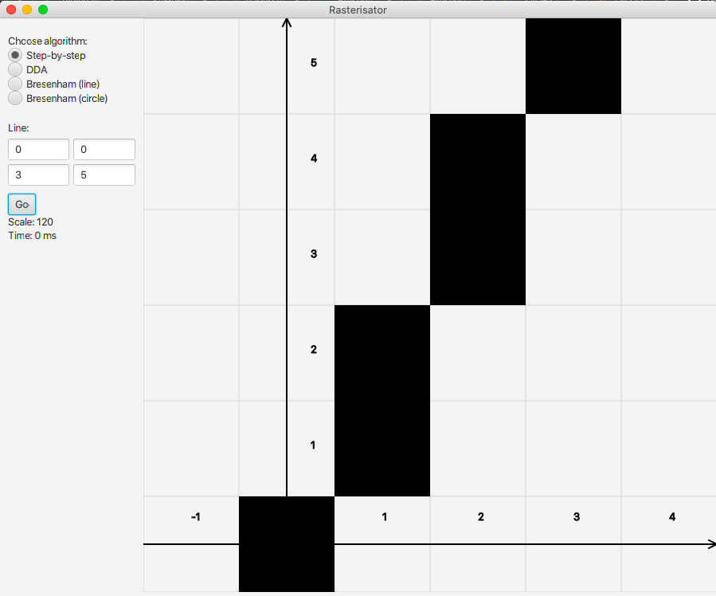

# Rasterisation

This repo contains a simple app that demonstrates 4 rasterisation algorithms:
- Naive (step-by-step) line rasterisation
- DDA
- Bresenham's algorithm for lines
- Bresenham's algorithm for circles

## Algorithms
As an example for all algorithms I will be using the line from (0,0) to (3,1) and the circle with the center in (0,0) and the  radius of 3.

### Step-by-step
We start at point (0,0). Since the difference by ```Y``` is 1 and the difference by ```X``` is 3, we will iterate through all integer values of ```x``` and calculate ```y```. But first we calculate the coefficient ```k = (y1 - y0) / (x1 - x0) = 1/3```.

Now we can start iterating though ```x```, using the rule ```y = k(x - x0) + y0 = 1/3x``` to calculate ```y```.

```
+------+---------+
|  x   |    y    |
+------+---------+
|  0   | 0       |
|  1   | 1/3 = 0 |
|  2   | 2/3 = 1 |
|  3   | 3/3 = 1 |
+------+---------+
```

### DDA
Again we start at (0,0). But before that, we want to calculate the difference of ```x``` ```deltaX = x1 - x0 = 3``` and the difference of ```y``` ```deltaY = y1 - y0 = 1```. And like in the naive version, we take note, which of ```|x|``` or ```|y|``` is larger, and save that number to ```steps```. Here, ```steps = 3```. Based on ```steps```, we calculate ```dx = deltaX / steps = 3 / 3 = 1``` and ```dy = deltaY / steps = 1/3``` – essentially, by how much we want to increment that coordinate on every step.

Now for every ```i``` from 0 to ```steps``` we add a new point and increment ```x``` and ```y``` by ```dx``` and ```dy``` respectively:
```
+------+-------+-------+
|  i   |   x   |   y   |
+------+-------+-------+
|  0   |   0   |   0   |
|  1   |   1   |   0   |
|  2   |   2   |   1   |
|  3   |   3   |   1   |
+------+-------+-------+
```

### Bresenham's algorithm for lines
We again start by calculating some parameters: ```dx = 2 * |x1 - x0| = 6```, ```dy = 2 * |y1 - y0| = 2```, ```stepX = sign(x1 - x0) = 1```, ```stepY = sign(y1 - y0) = 1```. Then we once again look at which is bigger, ```dx``` or ```dy``` – ```dx``` in this example. Based on this, we calculate the initial value for a decision variable ```fraction = dy - .5 * dx = 2 - 3 = -1```. Note that ```fraction``` is always an integer.

Now we start iterating ```x``` from ```x0``` to ```x1```. On every step, we increment ```x```. Then, we increment ```y``` if ```fraction``` is greater than or equal to 0. In that case, we also subtract ```dx``` from ```fraction```. Finally, we add ```dy``` to ```fraction```. The reason for all these manipulations with ```fraction``` is to keep track of where the line is, so that we could decide between the points ```(x,y)``` and ```(x, y+1)``` for every new ```x```. Essentially, the value of ```fraction``` bigger than 0 means that we are over halfway between two vertically adjacent points, and we should choose the top one; the value of less than 0 means that we are not yet there, so we should choose the bottom one. 

Concrete example:
```
+------+-----------------------------------+-------+
|  x   |             fraction              |   y   |
+------+-----------------------------------+-------+
|  0   |              -1 < 0               |   0   | 
|  1   |      -1 + dy = -1 + 2 = 1 > 0     |   0   |
|  2   | 1 - dx + dy = 1 - 6 + 2 = -3 < 0  |   1   |
|  3   |            -3 + 2 = -1            |   1   |
+------+-----------------------------------+-------+
```

### Bresenham's algorithms for circles:
Let us consider the example of a circle with center in (0,0) and the radius of 3. First, we note that for every point in any octant we can readily put 7 other, symmetrical points. Then we apply reasoning similar to the line case.

We start from the point ```(0,r)```. From there, we increment ```x``` until it is larger that ```y```. But that is not all. On every step, we also take into account the value of ```fraction``` on previous step and change ```y``` and ```fraction``` accordingly.

For details, I direct you to my implementation, but let's go through an example.
```
+---+---+--------------------+----------------------------------------------------------------+
| x | y | fraction           | added points                                                   |
+---+---+--------------------+----------------------------------------------------------------+
| 0 | 3 | 3 - 2r = -3 < 0    | (0,3), (0,-3), (3,0), (-3,0)                                   |
| 1 | 3 | -3 + 4 + 6 = 7 > 0 | (1,3), (-1,3), (1,-3), (-1,-3), (3,1), (-3,1), (3,-1), (-3,-1) |
| 2 | 2 | does not matter    | (2,2), (-2,2), (2,-2), (-2,-2)                                 |
+---+---+--------------------+----------------------------------------------------------------+
```

## Time complexity
The first three algorithms were tested on line from (0,0) to ```(1e6,1e6)```. Here are the results:
```
+-----------+----------+
| algorithm | time, ms |
+-----------+----------+
| naive     | 41       |
| DDA       | 33       |
| Bresenham | 21       |
+-----------+----------+
```
As expected, the step-by-step naive algorithm works the slowest, and Bresenham -- the fastest.

By comparison, the circle algorithm for circle with center in (0,0) and the radius of 1e6 works in approximately 170ms. But there's no direct comparison, as a circle obviously has more point.


## User interface and usage
Generally, the UI looks like this:


On the left you can see a simple form that allows the user to choose an algorithm and enter values, and the result is displayed on the right.

__Important note__: For the purposes of this assignment, the point (0,0) is the entire square. You can think of it as the point being in the center of that square. This decision is reflected in the design of axes, which go straight through center. Grid lines, however, outline the borders between cells-"pixels" and do not reflect the placement of coordinates.

Another thing to note is that the coordinate plane adjusts in scale automatically according to input. However, because the screen itself is discreet, sometimes you can see artifacts of rounding in the placement of the grid lines.

Using the app is very simple. First, you choose the desired algorithm. Then, you enter the coordinates of the line or the circle as specified. Finally, the result is displayed after you click on the button "Go". Under the button you can also see the current __scale__ of the image (number of actual pixels per one "pixel"-cell of the grid) and the __time__ it took to rasterise the specified figure.


## Structure
- [line_utils](src/com/emelyanova/line_utils) contain a single class of ```Dot``` (a single pixel on the grid);;
- [rasterisation](src/com/emelyanova/rasterisation) contains rasterisers, one for every algorithm, and their common interface;
- [ui](src/com/emelyanova/ui) contains, as always, UI classes. ```Main``` is self-explanatory and ```GraphContext``` contains general parameters of the currently displayed grid.
